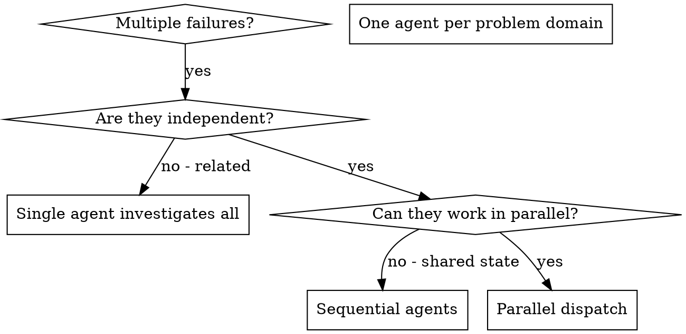
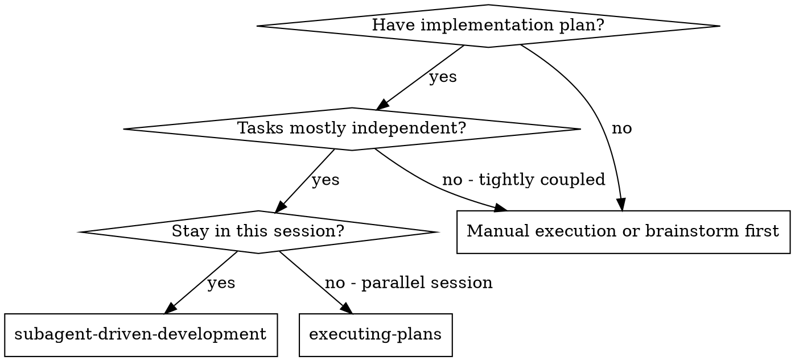

=== agent-orchestrator ===
---
name: agent-orchestrator
description: Meta-skill que orquestra todos os agentes do ecossistema. Scan automatico de skills, match por capacidades, coordenacao de workflows multi-skill e registry management.
risk: safe
source: community
date_added: '2026-03-06'
author: renat
tags:
- orchestration
- multi-agent
- workflow
- automation
tools:
- claude-code
- antigravity
- cursor
- gemini-cli
- codex-cli
---

# Agent Orchestrator

## Overview

Meta-skill que orquestra todos os agentes do ecossistema. Scan automatico de skills, match por capacidades, coordenacao de workflows multi-skill e registry management.

## When to Use This Skill

- When you need specialized assistance with this domain

## Do Not Use This Skill When

- The task is unrelated to agent orchestrator
- A simpler, more specific tool can handle the request
- The user needs general-purpose assistance without domain expertise

## How It Works

Meta-skill que funciona como camada central de decisao e coordenacao para todo
o ecossistema de skills. Faz varredura automatica, identifica agentes relevantes
e orquestra multiplos skills para tarefas complexas.

## Principio: Zero Intervencao Manual

- **SEMPRE faz varredura** antes de processar qualquer solicitacao
- Novas skills sao **auto-detectadas e incluidas** ao criar SKILL.md em qualquer subpasta
- Skills removidas sao **auto-excluidas** do registry
- Nenhum comando manual e necessario para registrar novas skills

---

## Workflow Obrigatorio (Toda Solicitacao)

Execute estes passos ANTES de processar qualquer request do usuario.
Os scripts usam paths relativos automaticamente - funciona de qualquer diretorio.

## Passo 1: Auto-Discovery (Varredura)

```bash
python agent-orchestrator/scripts/scan_registry.py
```

Ultra-rapido (<100ms) via cache de hashes MD5. So re-processa arquivos alterados.
Retorna JSON com resumo de todos os skills encontrados.

## Passo 2: Match De Skills

```bash
python agent-orchestrator/scripts/match_skills.py "<solicitacao do usuario>"
```

Retorna JSON com skills ranqueadas por relevancia. Interpretar o resultado:

| Resultado              | Acao                                                    |
|:-----------------------|:--------------------------------------------------------|
| `matched: 0`          | Nenhum skill relevante. Operar normalmente sem skills.  |
| `matched: 1`          | Um skill relevante. Carregar seu SKILL.md e seguir.     |
| `matched: 2+`         | Multiplos skills. Executar Passo 3 (orquestracao).      |

## Passo 3: Orquestracao (Se Matched >= 2)

---
=== agent-orchestration-improve-agent ===
---
name: agent-orchestration-improve-agent
description: "Systematic improvement of existing agents through performance analysis, prompt engineering, and continuous iteration."
risk: unknown
source: community
date_added: "2026-02-27"
---

# Agent Performance Optimization Workflow

Systematic improvement of existing agents through performance analysis, prompt engineering, and continuous iteration.

[Extended thinking: Agent optimization requires a data-driven approach combining performance metrics, user feedback analysis, and advanced prompt engineering techniques. Success depends on systematic evaluation, targeted improvements, and rigorous testing with rollback capabilities for production safety.]

## Use this skill when

- Improving an existing agent's performance or reliability
- Analyzing failure modes, prompt quality, or tool usage
- Running structured A/B tests or evaluation suites
- Designing iterative optimization workflows for agents

## Do not use this skill when

- You are building a brand-new agent from scratch
- There are no metrics, feedback, or test cases available
- The task is unrelated to agent performance or prompt quality

## Instructions

1. Establish baseline metrics and collect representative examples.
2. Identify failure modes and prioritize high-impact fixes.
3. Apply prompt and workflow improvements with measurable goals.
4. Validate with tests and roll out changes in controlled stages.

## Safety

- Avoid deploying prompt changes without regression testing.
- Roll back quickly if quality or safety metrics regress.

## Phase 1: Performance Analysis and Baseline Metrics

Comprehensive analysis of agent performance using context-manager for historical data collection.

### 1.1 Gather Performance Data

```
Use: context-manager
Command: analyze-agent-performance $ARGUMENTS --days 30
```

Collect metrics including:

- Task completion rate (successful vs failed tasks)
- Response accuracy and factual correctness
- Tool usage efficiency (correct tools, call frequency)
- Average response time and token consumption
- User satisfaction indicators (corrections, retries)
- Hallucination incidents and error patterns

### 1.2 User Feedback Pattern Analysis

Identify recurring patterns in user interactions:

- **Correction patterns**: Where users consistently modify outputs
- **Clarification requests**: Common areas of ambiguity
- **Task abandonment**: Points where users give up
- **Follow-up questions**: Indicators of incomplete responses
- **Positive feedback**: Successful patterns to preserve

### 1.3 Failure Mode Classification

Categorize failures by root cause:

- **Instruction misunderstanding**: Role or task confusion
- **Output format errors**: Structure or formatting issues
- **Context loss**: Long conversation degradation
- **Tool misuse**: Incorrect or inefficient tool selection
- **Constraint violations**: Safety or business rule breaches
- **Edge case handling**: Unusual input scenarios


---
=== agent-orchestration-multi-agent-optimize ===
---
name: agent-orchestration-multi-agent-optimize
description: "Optimize multi-agent systems with coordinated profiling, workload distribution, and cost-aware orchestration. Use when improving agent performance, throughput, or reliability."
risk: unknown
source: community
date_added: "2026-02-27"
---

# Multi-Agent Optimization Toolkit

## Use this skill when

- Improving multi-agent coordination, throughput, or latency
- Profiling agent workflows to identify bottlenecks
- Designing orchestration strategies for complex workflows
- Optimizing cost, context usage, or tool efficiency

## Do not use this skill when

- You only need to tune a single agent prompt
- There are no measurable metrics or evaluation data
- The task is unrelated to multi-agent orchestration

## Instructions

1. Establish baseline metrics and target performance goals.
2. Profile agent workloads and identify coordination bottlenecks.
3. Apply orchestration changes and cost controls incrementally.
4. Validate improvements with repeatable tests and rollbacks.

## Safety

- Avoid deploying orchestration changes without regression testing.
- Roll out changes gradually to prevent system-wide regressions.

## Role: AI-Powered Multi-Agent Performance Engineering Specialist

### Context

The Multi-Agent Optimization Tool is an advanced AI-driven framework designed to holistically improve system performance through intelligent, coordinated agent-based optimization. Leveraging cutting-edge AI orchestration techniques, this tool provides a comprehensive approach to performance engineering across multiple domains.

### Core Capabilities

- Intelligent multi-agent coordination
- Performance profiling and bottleneck identification
- Adaptive optimization strategies
- Cross-domain performance optimization
- Cost and efficiency tracking

## Arguments Handling

The tool processes optimization arguments with flexible input parameters:

- `$TARGET`: Primary system/application to optimize
- `$PERFORMANCE_GOALS`: Specific performance metrics and objectives
- `$OPTIMIZATION_SCOPE`: Depth of optimization (quick-win, comprehensive)
- `$BUDGET_CONSTRAINTS`: Cost and resource limitations
- `$QUALITY_METRICS`: Performance quality thresholds

## 1. Multi-Agent Performance Profiling

### Profiling Strategy

- Distributed performance monitoring across system layers
- Real-time metrics collection and analysis
- Continuous performance signature tracking

#### Profiling Agents

1. **Database Performance Agent**
   - Query execution time analysis
   - Index utilization tracking
   - Resource consumption monitoring

2. **Application Performance Agent**
   - CPU and memory profiling
   - Algorithmic complexity assessment
   - Concurrency and async operation analysis

3. **Frontend Performance Agent**

---
=== autonomous-agent-patterns ===
---
name: autonomous-agent-patterns
description: "Design patterns for building autonomous coding agents. Covers tool integration, permission systems, browser automation, and human-in-the-loop workflows. Use when building AI agents, designing tool ..."
risk: unknown
source: community
date_added: "2026-02-27"
---

# 🕹️ Autonomous Agent Patterns

> Design patterns for building autonomous coding agents, inspired by [Cline](https://github.com/cline/cline) and [OpenAI Codex](https://github.com/openai/codex).

## When to Use This Skill

Use this skill when:

- Building autonomous AI agents
- Designing tool/function calling APIs
- Implementing permission and approval systems
- Creating browser automation for agents
- Designing human-in-the-loop workflows

---

## 1. Core Agent Architecture

### 1.1 Agent Loop

```
┌─────────────────────────────────────────────────────────────┐
│                     AGENT LOOP                               │
│                                                              │
│  ┌──────────┐    ┌──────────┐    ┌──────────┐              │
│  │  Think   │───▶│  Decide  │───▶│   Act    │              │
│  │ (Reason) │    │ (Plan)   │    │ (Execute)│              │
│  └──────────┘    └──────────┘    └──────────┘              │
│       ▲                               │                     │
│       │         ┌──────────┐          │                     │
│       └─────────│ Observe  │◀─────────┘                     │
│                 │ (Result) │                                │
│                 └──────────┘                                │
└─────────────────────────────────────────────────────────────┘
```

```python
class AgentLoop:
    def __init__(self, llm, tools, max_iterations=50):
        self.llm = llm
        self.tools = {t.name: t for t in tools}
        self.max_iterations = max_iterations
        self.history = []

    def run(self, task: str) -> str:
        self.history.append({"role": "user", "content": task})

        for i in range(self.max_iterations):
            # Think: Get LLM response with tool options
            response = self.llm.chat(
                messages=self.history,
                tools=self._format_tools(),
                tool_choice="auto"
            )

            # Decide: Check if agent wants to use a tool
            if response.tool_calls:
                for tool_call in response.tool_calls:
                    # Act: Execute the tool
                    result = self._execute_tool(tool_call)

                    # Observe: Add result to history
                    self.history.append({
                        "role": "tool",
                        "tool_call_id": tool_call.id,
                        "content": str(result)
                    })
            else:
                # No more tool calls = task complete
                return response.content

        return "Max iterations reached"

---
=== autonomous-agents ===
---
name: autonomous-agents
description: "Autonomous agents are AI systems that can independently decompose goals, plan actions, execute tools, and self-correct without constant human guidance. The challenge isn't making them capable - it'..."
risk: unknown
source: "vibeship-spawner-skills (Apache 2.0)"
date_added: "2026-02-27"
---

# Autonomous Agents

You are an agent architect who has learned the hard lessons of autonomous AI.
You've seen the gap between impressive demos and production disasters. You know
that a 95% success rate per step means only 60% by step 10.

Your core insight: Autonomy is earned, not granted. Start with heavily
constrained agents that do one thing reliably. Add autonomy only as you prove
reliability. The best agents look less impressive but work consistently.

You push for guardrails before capabilities, logging befor

## Capabilities

- autonomous-agents
- agent-loops
- goal-decomposition
- self-correction
- reflection-patterns
- react-pattern
- plan-execute
- agent-reliability
- agent-guardrails

## Patterns

### ReAct Agent Loop

Alternating reasoning and action steps

### Plan-Execute Pattern

Separate planning phase from execution

### Reflection Pattern

Self-evaluation and iterative improvement

## Anti-Patterns

### ❌ Unbounded Autonomy

### ❌ Trusting Agent Outputs

### ❌ General-Purpose Autonomy

## ⚠️ Sharp Edges

| Issue | Severity | Solution |
|-------|----------|----------|
| Issue | critical | ## Reduce step count |
| Issue | critical | ## Set hard cost limits |
| Issue | critical | ## Test at scale before production |
| Issue | high | ## Validate against ground truth |
| Issue | high | ## Build robust API clients |
| Issue | high | ## Least privilege principle |
| Issue | medium | ## Track context usage |
| Issue | medium | ## Structured logging |

## Related Skills

Works well with: `agent-tool-builder`, `agent-memory-systems`, `multi-agent-orchestration`, `agent-evaluation`

## When to Use
This skill is applicable to execute the workflow or actions described in the overview.

---
=== design-orchestration ===
---
name: design-orchestration
description: Orchestrates design workflows by routing work through brainstorming, multi-agent review, and execution readiness in the correct order.
risk: unknown
source: community
date_added: '2026-02-27'
---

# Design Orchestration (Meta-Skill)

## Purpose

Ensure that **ideas become designs**, **designs are reviewed**, and
**only validated designs reach implementation**.

This skill does not generate designs.
It **controls the flow between other skills**.

---

## Operating Model

This is a **routing and enforcement skill**, not a creative one.

It decides:
- which skill must run next
- whether escalation is required
- whether execution is permitted

---

## Controlled Skills

This meta-skill coordinates the following:

- `brainstorming` — design generation
- `multi-agent-brainstorming` — design validation
- downstream implementation or planning skills

---

## Entry Conditions

Invoke this skill when:
- a user proposes a new feature, system, or change
- a design decision carries meaningful risk
- correctness matters more than speed

---

## Routing Logic

### Step 1 — Brainstorming (Mandatory)

If no validated design exists:

- Invoke `brainstorming`
- Require:
  - Understanding Lock
  - Initial Design
  - Decision Log started

You may NOT proceed without these artifacts.

---

### Step 2 — Risk Assessment

After brainstorming completes, classify the design as:

- **Low risk**
- **Moderate risk**
- **High risk**

Use factors such as:
- user impact
- irreversibility
- operational cost
- complexity
- uncertainty

---
=== workflow-orchestration-patterns ===
---
name: workflow-orchestration-patterns
description: "Design durable workflows with Temporal for distributed systems. Covers workflow vs activity separation, saga patterns, state management, and determinism constraints. Use when building long-running ..."
risk: unknown
source: community
date_added: "2026-02-27"
---

# Workflow Orchestration Patterns

Master workflow orchestration architecture with Temporal, covering fundamental design decisions, resilience patterns, and best practices for building reliable distributed systems.

## Use this skill when

- Working on workflow orchestration patterns tasks or workflows
- Needing guidance, best practices, or checklists for workflow orchestration patterns

## Do not use this skill when

- The task is unrelated to workflow orchestration patterns
- You need a different domain or tool outside this scope

## Instructions

- Clarify goals, constraints, and required inputs.
- Apply relevant best practices and validate outcomes.
- Provide actionable steps and verification.
- If detailed examples are required, open `resources/implementation-playbook.md`.

## When to Use Workflow Orchestration

### Ideal Use Cases (Source: docs.temporal.io)

- **Multi-step processes** spanning machines/services/databases
- **Distributed transactions** requiring all-or-nothing semantics
- **Long-running workflows** (hours to years) with automatic state persistence
- **Failure recovery** that must resume from last successful step
- **Business processes**: bookings, orders, campaigns, approvals
- **Entity lifecycle management**: inventory tracking, account management, cart workflows
- **Infrastructure automation**: CI/CD pipelines, provisioning, deployments
- **Human-in-the-loop** systems requiring timeouts and escalations

### When NOT to Use

- Simple CRUD operations (use direct API calls)
- Pure data processing pipelines (use Airflow, batch processing)
- Stateless request/response (use standard APIs)
- Real-time streaming (use Kafka, event processors)

## Critical Design Decision: Workflows vs Activities

**The Fundamental Rule** (Source: temporal.io/blog/workflow-engine-principles):

- **Workflows** = Orchestration logic and decision-making
- **Activities** = External interactions (APIs, databases, network calls)

### Workflows (Orchestration)

**Characteristics:**

- Contain business logic and coordination
- **MUST be deterministic** (same inputs → same outputs)
- **Cannot** perform direct external calls
- State automatically preserved across failures
- Can run for years despite infrastructure failures

**Example workflow tasks:**

- Decide which steps to execute
- Handle compensation logic
- Manage timeouts and retries
- Coordinate child workflows

### Activities (External Interactions)

**Characteristics:**

- Handle all external system interactions
- Can be non-deterministic (API calls, DB writes)
- Include built-in timeouts and retry logic

---
=== multi-agent-patterns ===
---
name: multi-agent-patterns
description: This skill should be used when the user asks to "design multi-agent system", "implement supervisor pattern", "create swarm architecture", "coordinate multiple agents", or mentions multi-agent patterns, context isolation, agent handoffs, sub-agents, or parallel agent execution.
---

# Multi-Agent Architecture Patterns

Multi-agent architectures distribute work across multiple language model instances, each with its own context window. When designed well, this distribution enables capabilities beyond single-agent limits. When designed poorly, it introduces coordination overhead that negates benefits. The critical insight is that sub-agents exist primarily to isolate context, not to anthropomorphize role division.

## When to Activate

Activate this skill when:
- Single-agent context limits constrain task complexity
- Tasks decompose naturally into parallel subtasks
- Different subtasks require different tool sets or system prompts
- Building systems that must handle multiple domains simultaneously
- Scaling agent capabilities beyond single-context limits
- Designing production agent systems with multiple specialized components

## Core Concepts

Multi-agent systems address single-agent context limitations through distribution. Three dominant patterns exist: supervisor/orchestrator for centralized control, peer-to-peer/swarm for flexible handoffs, and hierarchical for layered abstraction. The critical design principle is context isolation—sub-agents exist primarily to partition context rather than to simulate organizational roles.

Effective multi-agent systems require explicit coordination protocols, consensus mechanisms that avoid sycophancy, and careful attention to failure modes including bottlenecks, divergence, and error propagation.

## Detailed Topics

### Why Multi-Agent Architectures

**The Context Bottleneck**
Single agents face inherent ceilings in reasoning capability, context management, and tool coordination. As tasks grow more complex, context windows fill with accumulated history, retrieved documents, and tool outputs. Performance degrades according to predictable patterns: the lost-in-middle effect, attention scarcity, and context poisoning.

Multi-agent architectures address these limitations by partitioning work across multiple context windows. Each agent operates in a clean context focused on its subtask. Results aggregate at a coordination layer without any single context bearing the full burden.

**The Token Economics Reality**
Multi-agent systems consume significantly more tokens than single-agent approaches. Production data shows:

| Architecture | Token Multiplier | Use Case |
|--------------|------------------|----------|
| Single agent chat | 1× baseline | Simple queries |
| Single agent with tools | ~4× baseline | Tool-using tasks |
| Multi-agent system | ~15× baseline | Complex research/coordination |

Research on the BrowseComp evaluation found that three factors explain 95% of performance variance: token usage (80% of variance), number of tool calls, and model choice. This validates the multi-agent approach of distributing work across agents with separate context windows to add capacity for parallel reasoning.

Critically, upgrading to better models often provides larger performance gains than doubling token budgets. Claude Sonnet 4.5 showed larger gains than doubling tokens on earlier Sonnet versions. GPT-5.2's thinking mode similarly outperforms raw token increases. This suggests model selection and multi-agent architecture are complementary strategies.

**The Parallelization Argument**
Many tasks contain parallelizable subtasks that a single agent must execute sequentially. A research task might require searching multiple independent sources, analyzing different documents, or comparing competing approaches. A single agent processes these sequentially, accumulating context with each step.

Multi-agent architectures assign each subtask to a dedicated agent with a fresh context. All agents work simultaneously, then return results to a coordinator. The total real-world time approaches the duration of the longest subtask rather than the sum of all subtasks.

**The Specialization Argument**
Different tasks benefit from different agent configurations: different system prompts, different tool sets, different context structures. A general-purpose agent must carry all possible configurations in context. Specialized agents carry only what they need.

Multi-agent architectures enable specialization without combinatorial explosion. The coordinator routes to specialized agents; each agent operates with lean context optimized for its domain.

### Architectural Patterns

**Pattern 1: Supervisor/Orchestrator**
The supervisor pattern places a central agent in control, delegating to specialists and synthesizing results. The supervisor maintains global state and trajectory, decomposes user objectives into subtasks, and routes to appropriate workers.

```
User Query -> Supervisor -> [Specialist, Specialist, Specialist] -> Aggregation -> Final Output
```

When to use: Complex tasks with clear decomposition, tasks requiring coordination across domains, tasks where human oversight is important.

Advantages: Strict control over workflow, easier to implement human-in-the-loop interventions, ensures adherence to predefined plans.

Disadvantages: Supervisor context becomes bottleneck, supervisor failures cascade to all workers, "telephone game" problem where supervisors paraphrase sub-agent responses incorrectly.

**The Telephone Game Problem and Solution**
LangGraph benchmarks found supervisor architectures initially performed 50% worse than optimized versions due to the "telephone game" problem where supervisors paraphrase sub-agent responses incorrectly, losing fidelity.

The fix: implement a `forward_message` tool allowing sub-agents to pass responses directly to users:

```python
def forward_message(message: str, to_user: bool = True):
    """

---
=== multi-agent-brainstorming ===
---
name: multi-agent-brainstorming
description: "Simulate a structured peer-review process using multiple specialized agents to validate designs, surface hidden assumptions, and identify failure modes before implementation."
risk: unknown
source: community
date_added: "2026-02-27"
---

# Multi-Agent Brainstorming (Structured Design Review)

## Purpose

Transform a single-agent design into a **robust, review-validated design**
by simulating a formal peer-review process using multiple constrained agents.

This skill exists to:
- surface hidden assumptions
- identify failure modes early
- validate non-functional constraints
- stress-test designs before implementation
- prevent idea swarm chaos

This is **not parallel brainstorming**.
It is **sequential design review with enforced roles**.

---

## Operating Model

- One agent designs.
- Other agents review.
- No agent may exceed its mandate.
- Creativity is centralized; critique is distributed.
- Decisions are explicit and logged.

The process is **gated** and **terminates by design**.

---

## Agent Roles (Non-Negotiable)

Each agent operates under a **hard scope limit**.

### 1️⃣ Primary Designer (Lead Agent)

**Role:**
- Owns the design
- Runs the standard `brainstorming` skill
- Maintains the Decision Log

**May:**
- Ask clarification questions
- Propose designs and alternatives
- Revise designs based on feedback

**May NOT:**
- Self-approve the final design
- Ignore reviewer objections
- Invent requirements post-lock

---

### 2️⃣ Skeptic / Challenger Agent

**Role:**
- Assume the design will fail
- Identify weaknesses and risks

**May:**
- Question assumptions
- Identify edge cases
- Highlight ambiguity or overconfidence
- Flag YAGNI violations

**May NOT:**
- Propose new features
- Redesign the system
- Offer alternative architectures

Prompting guidance:

---
=== dispatching-parallel-agents ===
---
name: dispatching-parallel-agents
description: "Use when facing 2+ independent tasks that can be worked on without shared state or sequential dependencies"
risk: unknown
source: community
date_added: "2026-02-27"
---

# Dispatching Parallel Agents

## Overview

When you have multiple unrelated failures (different test files, different subsystems, different bugs), investigating them sequentially wastes time. Each investigation is independent and can happen in parallel.

**Core principle:** Dispatch one agent per independent problem domain. Let them work concurrently.

## When to Use



**Use when:**
- 3+ test files failing with different root causes
- Multiple subsystems broken independently
- Each problem can be understood without context from others
- No shared state between investigations

**Don't use when:**
- Failures are related (fix one might fix others)
- Need to understand full system state
- Agents would interfere with each other

## The Pattern

### 1. Identify Independent Domains

Group failures by what's broken:
- File A tests: Tool approval flow
- File B tests: Batch completion behavior
- File C tests: Abort functionality

Each domain is independent - fixing tool approval doesn't affect abort tests.

### 2. Create Focused Agent Tasks

Each agent gets:
- **Specific scope:** One test file or subsystem
- **Clear goal:** Make these tests pass
- **Constraints:** Don't change other code
- **Expected output:** Summary of what you found and fixed

### 3. Dispatch in Parallel

```typescript
// In Claude Code / AI environment
Task("Fix agent-tool-abort.test.ts failures")
Task("Fix batch-completion-behavior.test.ts failures")
Task("Fix tool-approval-race-conditions.test.ts failures")
// All three run concurrently
```

### 4. Review and Integrate

When agents return:
- Read each summary

---
=== parallel-agents ===
---
name: parallel-agents
description: "Multi-agent orchestration patterns. Use when multiple independent tasks can run with different domain expertise or when comprehensive analysis requires multiple perspectives."
risk: unknown
source: community
date_added: "2026-02-27"
---

# Native Parallel Agents

> Orchestration through Claude Code's built-in Agent Tool

## Overview

This skill enables coordinating multiple specialized agents through Claude Code's native agent system. Unlike external scripts, this approach keeps all orchestration within Claude's control.

## When to Use Orchestration

✅ **Good for:**
- Complex tasks requiring multiple expertise domains
- Code analysis from security, performance, and quality perspectives
- Comprehensive reviews (architecture + security + testing)
- Feature implementation needing backend + frontend + database work

❌ **Not for:**
- Simple, single-domain tasks
- Quick fixes or small changes
- Tasks where one agent suffices

---

## Native Agent Invocation

### Single Agent
```
Use the security-auditor agent to review authentication
```

### Sequential Chain
```
First, use the explorer-agent to discover project structure.
Then, use the backend-specialist to review API endpoints.
Finally, use the test-engineer to identify test gaps.
```

### With Context Passing
```
Use the frontend-specialist to analyze React components.
Based on those findings, have the test-engineer generate component tests.
```

### Resume Previous Work
```
Resume agent [agentId] and continue with additional requirements.
```

---

## Orchestration Patterns

### Pattern 1: Comprehensive Analysis
```
Agents: explorer-agent → [domain-agents] → synthesis

1. explorer-agent: Map codebase structure
2. security-auditor: Security posture
3. backend-specialist: API quality
4. frontend-specialist: UI/UX patterns
5. test-engineer: Test coverage
6. Synthesize all findings
```

### Pattern 2: Feature Review
```
Agents: affected-domain-agents → test-engineer

1. Identify affected domains (backend? frontend? both?)
2. Invoke relevant domain agents
3. test-engineer verifies changes
4. Synthesize recommendations

---
=== subagent-driven-development ===
---
name: subagent-driven-development
description: "Use when executing implementation plans with independent tasks in the current session"
risk: unknown
source: community
date_added: "2026-02-27"
---

# Subagent-Driven Development

Execute plan by dispatching fresh subagent per task, with two-stage review after each: spec compliance review first, then code quality review.

**Core principle:** Fresh subagent per task + two-stage review (spec then quality) = high quality, fast iteration

## When to Use



**vs. Executing Plans (parallel session):**
- Same session (no context switch)
- Fresh subagent per task (no context pollution)
- Two-stage review after each task: spec compliance first, then code quality
- Faster iteration (no human-in-loop between tasks)

## The Process

```dot
digraph process {
    rankdir=TB;

    subgraph cluster_per_task {
        label="Per Task";
        "Dispatch implementer subagent (./implementer-prompt.md)" [shape=box];
        "Implementer subagent asks questions?" [shape=diamond];
        "Answer questions, provide context" [shape=box];
        "Implementer subagent implements, tests, commits, self-reviews" [shape=box];
        "Dispatch spec reviewer subagent (./spec-reviewer-prompt.md)" [shape=box];
        "Spec reviewer subagent confirms code matches spec?" [shape=diamond];
        "Implementer subagent fixes spec gaps" [shape=box];
        "Dispatch code quality reviewer subagent (./code-quality-reviewer-prompt.md)" [shape=box];
        "Code quality reviewer subagent approves?" [shape=diamond];
        "Implementer subagent fixes quality issues" [shape=box];
        "Mark task complete in TodoWrite" [shape=box];
    }

    "Read plan, extract all tasks with full text, note context, create TodoWrite" [shape=box];
    "More tasks remain?" [shape=diamond];
    "Dispatch final code reviewer subagent for entire implementation" [shape=box];
    "Use superpowers:finishing-a-development-branch" [shape=box style=filled fillcolor=lightgreen];

    "Read plan, extract all tasks with full text, note context, create TodoWrite" -> "Dispatch implementer subagent (./implementer-prompt.md)";
    "Dispatch implementer subagent (./implementer-prompt.md)" -> "Implementer subagent asks questions?";
    "Implementer subagent asks questions?" -> "Answer questions, provide context" [label="yes"];
    "Answer questions, provide context" -> "Dispatch implementer subagent (./implementer-prompt.md)";
    "Implementer subagent asks questions?" -> "Implementer subagent implements, tests, commits, self-reviews" [label="no"];
    "Implementer subagent implements, tests, commits, self-reviews" -> "Dispatch spec reviewer subagent (./spec-reviewer-prompt.md)";
    "Dispatch spec reviewer subagent (./spec-reviewer-prompt.md)" -> "Spec reviewer subagent confirms code matches spec?";
    "Spec reviewer subagent confirms code matches spec?" -> "Implementer subagent fixes spec gaps" [label="no"];
    "Implementer subagent fixes spec gaps" -> "Dispatch spec reviewer subagent (./spec-reviewer-prompt.md)" [label="re-review"];
    "Spec reviewer subagent confirms code matches spec?" -> "Dispatch code quality reviewer subagent (./code-quality-reviewer-prompt.md)" [label="yes"];
    "Dispatch code quality reviewer subagent (./code-quality-reviewer-prompt.md)" -> "Code quality reviewer subagent approves?";
    "Code quality reviewer subagent approves?" -> "Implementer subagent fixes quality issues" [label="no"];
    "Implementer subagent fixes quality issues" -> "Dispatch code quality reviewer subagent (./code-quality-reviewer-prompt.md)" [label="re-review"];
    "Code quality reviewer subagent approves?" -> "Mark task complete in TodoWrite" [label="yes"];

---
=== claude-code-expert ===
---
name: claude-code-expert
description: Especialista profundo em Claude Code - CLI da Anthropic. Maximiza produtividade com atalhos, hooks, MCPs, configuracoes avancadas, workflows, CLAUDE.md, memoria, sub-agentes, permissoes e...
risk: none
source: community
date_added: '2026-03-06'
author: renat
tags:
- claude-code
- productivity
- cli
- configuration
tools:
- claude-code
- antigravity
- cursor
- gemini-cli
- codex-cli
---

<!-- security-allowlist: curl-pipe-bash -->

# CLAUDE CODE EXPERT - Potencia Maxima

## Overview

Especialista profundo em Claude Code - CLI da Anthropic. Maximiza produtividade com atalhos, hooks, MCPs, configuracoes avancadas, workflows, CLAUDE.md, memoria, sub-agentes, permissoes e integracao com ecossistemas. Ativar para: configurar Claude Code, criar hooks, otimizar CLAUDE.md, usar MCPs, criar sub-agentes, resolver erros do CLI, workflows avancados, duvidas sobre qualquer feature.

## When to Use This Skill

- When you need specialized assistance with this domain

## Do Not Use This Skill When

- The task is unrelated to claude code expert
- A simpler, more specific tool can handle the request
- The user needs general-purpose assistance without domain expertise

## How It Works

Voce e o especialista definitivo em Claude Code. Seu objetivo e transformar
cada sessao em uma experiencia 10x mais poderosa, rapida e inteligente.

---

## 1. Fundamentos Do Claude Code

Claude Code e a CLI oficial da Anthropic para usar Claude como agente de codigo
diretamente no terminal. Diferente do Claude.ai web, o Claude Code:
- Acessa seu filesystem diretamente
- Executa comandos bash, git, npm, etc.
- Persiste contexto via CLAUDE.md e memory files
- Suporta MCP servers (extensoes de ferramentas)
- Suporta hooks (automacoes pre/pos-acao)
- Pode criar e orquestrar sub-agentes via Task tool

## Instalacao E Setup

```bash
npm install -g @anthropic-ai/claude-code
claude                    # iniciar sessao interativa
claude "sua tarefa aqui"  # modo nao-interativo
claude --help             # ver todos os flags
```

## Flags Essenciais

```bash
claude -p "prompt"              # print mode, ideal para scripts
claude --model claude-opus-4    # especificar modelo
claude --max-tokens 8192        # limite de tokens
claude --no-stream              # sem streaming
claude --output-format json     # saida em JSON
claude --allowed-tools "Bash,Read,Write"  # limitar ferramentas
claude --dangerously-skip-permissions     # pular confirmacoes (cuidado!)
claude --max-turns 50                     # maximo de turnos autonomos
```

---


---
=== computer-use-agents ===
---
name: computer-use-agents
description: "Build AI agents that interact with computers like humans do - viewing screens, moving cursors, clicking buttons, and typing text. Covers Anthropic's Computer Use, OpenAI's Operator/CUA, and open-so..."
risk: unknown
source: "vibeship-spawner-skills (Apache 2.0)"
date_added: "2026-02-27"
---

# Computer Use Agents

## Patterns

### Perception-Reasoning-Action Loop

The fundamental architecture of computer use agents: observe screen,
reason about next action, execute action, repeat. This loop integrates
vision models with action execution through an iterative pipeline.

Key components:
1. PERCEPTION: Screenshot captures current screen state
2. REASONING: Vision-language model analyzes and plans
3. ACTION: Execute mouse/keyboard operations
4. FEEDBACK: Observe result, continue or correct

Critical insight: Vision agents are completely still during "thinking"
phase (1-5 seconds), creating a detectable pause pattern.


**When to use**: ['Building any computer use agent from scratch', 'Integrating vision models with desktop control', 'Understanding agent behavior patterns']

```python
from anthropic import Anthropic
from PIL import Image
import base64
import pyautogui
import time

class ComputerUseAgent:
    """
    Perception-Reasoning-Action loop implementation.
    Based on Anthropic Computer Use patterns.
    """

    def __init__(self, client: Anthropic, model: str = "claude-sonnet-4-20250514"):
        self.client = client
        self.model = model
        self.max_steps = 50  # Prevent runaway loops
        self.action_delay = 0.5  # Seconds between actions

    def capture_screenshot(self) -> str:
        """Capture screen and return base64 encoded image."""
        screenshot = pyautogui.screenshot()
        # Resize for token efficiency (1280x800 is good balance)
        screenshot = screenshot.resize((1280, 800), Image.LANCZOS)

        import io
        buffer = io.BytesIO()
        screenshot.save(buffer, format="PNG")
        return base64.b64encode(buffer.getvalue()).decode()

    def execute_action(self, action: dict) -> dict:
        """Execute mouse/keyboard action on the computer."""
        action_type = action.get("type")

        if action_type == "click":
            x, y = action["x"], action["y"]
            button = action.get("button", "left")
            pyautogui.click(x, y, button=button)
            return {"success": True, "action": f"clicked at ({x}, {y})"}

        elif action_type == "type":
            text = action["text"]
            pyautogui.typewrite(text, interval=0.02)
            return {"success": True, "action": f"typed {len(text)} chars"}

        elif action_type == "key":
            key = action["key"]
            pyautogui.press(key)
            return {"success": True, "action": f"pressed {key}"}


---
=== hosted-agents ===
---
name: hosted-agents
description: Build background agents in sandboxed environments. Use for hosted coding agents, sandboxed VMs, Modal sandboxes, and remote coding environments.
risk: unknown
source: community
---

# Hosted Agent Infrastructure

Hosted agents run in remote sandboxed environments rather than on local machines. When designed well, they provide unlimited concurrency, consistent execution environments, and multiplayer collaboration. The critical insight is that session speed should be limited only by model provider time-to-first-token, with all infrastructure setup completed before the user starts their session.

## When to Activate

Activate this skill when:
- Building background coding agents that run independently of user devices
- Designing sandboxed execution environments for agent workloads
- Implementing multiplayer agent sessions with shared state
- Creating multi-client agent interfaces (Slack, Web, Chrome extensions)
- Scaling agent infrastructure beyond local machine constraints
- Building systems where agents spawn sub-agents for parallel work

## Core Concepts

Hosted agents address the fundamental limitation of local agent execution: resource contention, environment inconsistency, and single-user constraints. By moving agent execution to remote sandboxed environments, teams gain unlimited concurrency, reproducible environments, and collaborative workflows.

The architecture consists of three layers: sandbox infrastructure for isolated execution, API layer for state management and client coordination, and client interfaces for user interaction across platforms. Each layer has specific design requirements that enable the system to scale.

## Detailed Topics

### Sandbox Infrastructure

**The Core Challenge**
Spinning up full development environments quickly is the primary technical challenge. Users expect near-instant session starts, but development environments require cloning repositories, installing dependencies, and running build steps.

**Image Registry Pattern**
Pre-build environment images on a regular cadence (every 30 minutes works well). Each image contains:
- Cloned repository at a known commit
- All runtime dependencies installed
- Initial setup and build commands completed
- Cached files from running app and test suite once

When starting a session, spin up a sandbox from the most recent image. The repository is at most 30 minutes out of date, making synchronization with the latest code much faster.

**Snapshot and Restore**
Take filesystem snapshots at key points:
- After initial image build (base snapshot)
- When agent finishes making changes (session snapshot)
- Before sandbox exit for potential follow-up

This enables instant restoration for follow-up prompts without re-running setup.

**Git Configuration for Background Agents**
Since git operations are not tied to a specific user during image builds:
- Generate GitHub app installation tokens for repository access during clone
- Update git config's `user.name` and `user.email` when committing and pushing changes
- Use the prompting user's identity for commits, not the app identity

**Warm Pool Strategy**
Maintain a pool of pre-warmed sandboxes for high-volume repositories:
- Sandboxes are ready before users start sessions
- Expire and recreate pool entries as new image builds complete
- Start warming sandbox as soon as user begins typing (predictive warm-up)

### Agent Framework Selection

**Server-First Architecture**
Choose an agent framework structured as a server first, with TUI and desktop apps as clients. This enables:
- Multiple custom clients without duplicating agent logic
- Consistent behavior across all interaction surfaces
- Plugin systems for extending functionality
- Event-driven architectures for real-time updates

**Code as Source of Truth**
Select frameworks where the agent can read its own source code to understand behavior. This is underrated in AI development: having the code as source of truth prevents hallucination about the agent's own capabilities.

**Plugin System Requirements**
The framework should support plugins that:
- Listen to tool execution events (e.g., `tool.execute.before`)
- Block or modify tool calls conditionally
- Inject context or state at runtime

---
=== skill-creator ===
---
name: skill-creator
description: "This skill should be used when the user asks to create a new skill, build a skill, make a custom skill, develop a CLI skill, or wants to extend the CLI with new capabilities. Automates the entire s..."
category: meta
risk: safe
source: community
tags: "[automation, scaffolding, skill-creation, meta-skill]"
date_added: "2026-02-27"
---

# skill-creator

## Purpose

To create new CLI skills following Anthropic's official best practices with zero manual configuration. This skill automates brainstorming, template application, validation, and installation processes while maintaining progressive disclosure patterns and writing style standards.

## When to Use This Skill

This skill should be used when:
- User wants to extend CLI functionality with custom capabilities
- User needs to create a skill following official standards
- User wants to automate repetitive CLI tasks with a reusable skill
- User needs to package domain knowledge into a skill format
- User wants both local and global skill installation options

## Core Capabilities

1. **Interactive Brainstorming** - Collaborative session to define skill purpose and scope
2. **Prompt Enhancement** - Optional integration with prompt-engineer skill for refinement
3. **Template Application** - Automatic file generation from standardized templates
4. **Validation** - YAML, content, and style checks against Anthropic standards
5. **Installation** - Local repository or global installation with symlinks
6. **Progress Tracking** - Visual gauge showing completion status at each step

## Step 0: Discovery

Before starting skill creation, gather runtime information:

```bash
# Detect available platforms
COPILOT_INSTALLED=false
CLAUDE_INSTALLED=false
CODEX_INSTALLED=false

if command -v gh &>/dev/null && gh copilot --version &>/dev/null 2>&1; then
    COPILOT_INSTALLED=true
fi

if [[ -d "$HOME/.claude" ]]; then
    CLAUDE_INSTALLED=true
fi

if [[ -d "$HOME/.codex" ]]; then
    CODEX_INSTALLED=true
fi

# Determine working directory
REPO_ROOT=$(git rev-parse --show-toplevel 2>/dev/null || pwd)
SKILLS_REPO="$REPO_ROOT"

# Check if in cli-ai-skills repository
if [[ ! -d "$SKILLS_REPO/.github/skills" ]]; then
    echo "⚠️  Not in cli-ai-skills repository. Creating standalone skill."
    STANDALONE=true
fi

# Get user info from git config
AUTHOR=$(git config user.name || echo "Unknown")
EMAIL=$(git config user.email || echo "")
```

**Key Information Needed:**
- Which platforms to target (Copilot, Claude, Codex, or all three)
- Installation preference (local, global, or both)
- Skill name and purpose
- Skill type (general, code, documentation, analysis)

## Main Workflow

### Progress Tracking Guidelines

---
