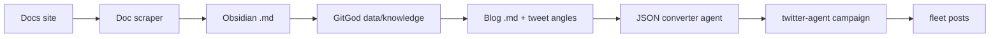
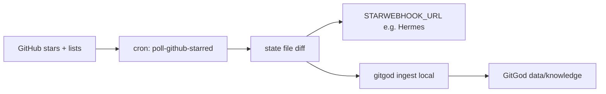

# Data flow arc (hood & gang)

GitGod is the capture + storage layer; this document is the **north-star pipeline** from upstream docs through knowledge, content, and fleet distribution.

## End-to-end flow

### Parallel ingress: GitHub stars / star lists (RSS-style poll)

Not the same as “docs site → scraper,” but it lands in the same **`data/` knowledge** layer:

- **Trigger:** Scheduled poll (no GitHub push). First run baselines state; later runs emit events for new stars and **list add/remove** (topic-style lists).
- **Out:** JSON POST to your receiver (`hermes.*` routing fields in payload) + optional local ingest. Downstream agents (e.g. Metatron) consume the **HTTP webhook**, not MCP, for real-time handoff.
- **Agents in Cursor/IDE:** Use **`gitgod serve` (MCP)** to query ingested knowledge (`ask` / `find` / …); use a **skill** or **invoke** allowlist if the agent must run the poller script on demand.

## Stages (plain language)

| Stage | Output | Role |
|-------|--------|------|
| **Docs site** | Live provider / product docs | Source of truth upstream |
| **Doc scraper** | Clean markdown chunks | Ingest + normalize (e.g. Firecrawl-class pipelines) |
| **Obsidian .md** | Human-readable vault notes | Review, link, tag; optional sync target |
| **GitGod `data/` (knowledge)** | Structured repo knowledge | Durable store GitGod owns; paths/manifests for agents |
| **Blog .md** | Narrative + **tweet angles** | Editorial layer on top of knowledge |
| **JSON converter agent** | Campaign-ready payloads | Structured posts / threads for automation |
| **twitter-agent campaign** | Scheduled / batched actions | Orchestration, rate limits, logging |
| **Fleet posts** | Live X posts | Multi-account fleet execution |

## Read vs write

- **Ingest path:** Docs → scraper → Obsidian + GitGod `data/` (writers: GitGod CLI / pipelines).
- **Distribution path:** Knowledge → blog notes → JSON → twitter-agent → fleet.

## Options (same arc, different wiring)

These are **forks**, not extra boxes on the main diagram — pick what fits.

| Option | When to use |
|--------|-------------|
| **Obsidian ↔ GitGod order** | Diagram shows vault → `data/`; you can **parallel-write** (scraper → both) or **vault-first** then sync into `data/` — order is a product choice, not a law. |
| **Who reads Mobile / knowledge** | **Vault path:** any tool reads `.md` on disk. **MCP:** expose the vault or an indexer to Cursor/agents. **GitGod API:** only if you need **triggers** (new scrape) or metadata not in files. |
| **Blog + tweet angles** | **Human-led:** edit `.md`, then JSON agent. **Agent-assisted:** same files, more automation in the middle — arc unchanged. |
| **JSON → X** | **Full auto:** JSON → twitter-agent → fleet. **Manual:** skip JSON agent; paste from Obsidian. **Single account:** last step is one session, not fleet. |
| **Downstream protocols** | Distribution is **twitter-agent + sessions** today; swap last mile later without redrawing the arc (same story: structured payload → post). |

## Related

- Categories / vault layout: `README.md` in this folder (when present).
- Twitter fleet: `twitter-agent/README.md`.
- GitHub star / list poll → webhook → ingest: `scripts/poll-github-starred.ts`, `scripts/starred-poll-cron.sh`; env in `.env.example`.
